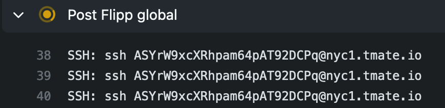

# Global Flipp action

This is a GitHub Action to be used in workflows at Flipp.

## Versions

The current major version tag is `v0`. When using actions in this repo you should generally use this tag. The repo will continue adding patch versions `v0.x` and advancing the `v0` tag to the latest patch version for all non-breaking changes.

## Usage

This action should be included in every job in every workflow. It provides tools that should be useful across all workflows, particularly in the pre/post steps. Having all this in one action should reduce noise in your config files and allow you to get new updates "for free" in the future.

A sample configuration may look like this:

```yaml
    - name: Flipp global
      uses: wishabi/github-actions@v0
      timeout-minutes: 10
      env:
        SLACK_BOT_TOKEN: "${{ secrets.SLACK_BOT_TOKEN }}"
      with:
        slack_channel: "${{env.SLACK_CHANNEL }}"
        job_status: "${{ job.status }}"
        enable_ssh: true
```

It doesn't matter where in the job this step appears, as only the pre/post steps are used.

## Slack Notifications

GitHub Actions does not have a native Slack integration, so this action will send a notification when your job fails. By default, only failed jobs will get a notification. 

Source code is based on [github-action-slack-notify-build](https://github.com/voxmedia/github-action-slack-notify-build).

## SSH sessions

If you need to debug your failed jobs, you can get a free SSH session to get into the box and root around. The SSH connection info will be printed out in the "Post-Flipp Global" step so you can connect. You need to be connected to the VPN in order to SSH in.



Note that *only the person who kicked off the workflow* will have access. In normal cases this will be the committer. You can re-run the job manually to give access to yourself if you are not the committer.

By default SSH sessions are **disabled** because they will cause your jobs to look like they're hanging for 10 minutes after they've failed. You can set the `enable_ssh` parameter to enable them.

Source code has been copied from [action-upterm](https://github.com/lhotari/action-upterm).

## Configuration

Configuration|Required?|Description
---|---|---
job_status|Yes|The value for this should always be `"${{ job.status }}"`. Unfortunately GitHub Actions doesn't have a way for the action itself to figure out if the job failed.
slack_channel|No|The Slack channel to send updates to. Recommendation is to set a top-level environment variable (`SLACK_CHANNEL`) and pass it in to all calls to this action to avoid having to find/replace things later on. If this value is not provided, Slack notifications won't happen.
slack_always|No|If set, both success and failure notifications will be sent to Slack.
enable_ssh|No|If set, SSH sessions will be created on failure.
ssh_always|No|If set, SSH sessions will always be created, even on success.

## Contributing

Please make sure to run `npm run prepare` before committing your files! You should probably add this to `.git/hooks/pre-commit`.

After creating a new minor patch version (ie `v0.x`), remember to update the major version tag to point to the latest patch.