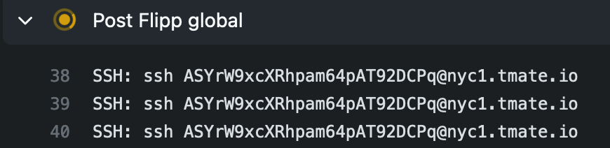

# Global Flipp action

This is a GitHub Action to be used in workflows at Flipp.

## Usage

This action should be included in every job in every workflow. It provides tools that should be useful across all workflows, particularly in the pre/post steps. Having all this in one action should reduce noise in your config files and allow you to get new updates "for free" in the future.

## Slack Notifications

GitHub Actions does not have a native Slack integration, so this action will send a notification when your job fails. By default, only failed jobs will get a notification. 

Source code is based on [github-action-slack-notify-build](https://github.com/voxmedia/github-action-slack-notify-build).

## Tmate SSH sessions

If you need to debug your failed jobs, you can get a free tmate session to SSH into the box and root around. The tmate connection info will be printed out in the "Post-Flipp Global" step so you can connect.

When you're ready to complete your SSH session, enter the command `touch continue` when you are in your root or home directory. Note that *only the person who kicked off the workflow* will have access. In normal cases this will be the committer. You can re-run the job manually to give access to yourself if you are not the committer.

By default tmate sessions are **disabled** because they will cause your jobs to look like they're hanging for 10 minutes after they've failed. You can set the `enable_tmate` parameter to enable them.

Source code has been copied from [action-tmate](https://github.com/mxschmitt/action-tmate).

## Configuration

Configuration|Required?|Description
---|---|---
job_status|Yes|The value for this should always be `"${{ job.status }}"`. Unfortunately GitHub Actions doesn't have a way for the action itself to figure out if the job failed.
slack_channel|No|The Slack channel to send updates to. Recommendation is to set a top-level environment variable (`SLACK_CHANNEL`) and pass it in to all calls to this action to avoid having to find/replace things later on. If this value is not provided, Slack notifications won't happen.
slack_always|No|If set, both success and failure notifications will be sent to Slack.
enable_tmate|No|If set, tmate sessions will be created on failure.

## Contributing

Please make sure to run `npm run prepare` before committing your files! You should probably add this to `.git/hooks/pre-commit`.
